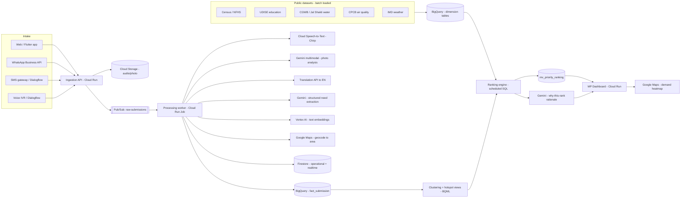
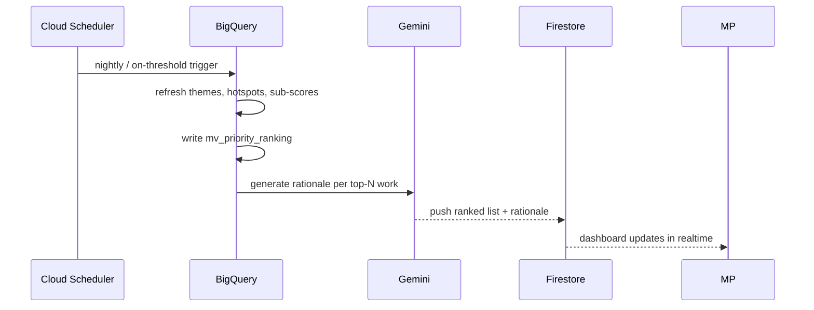

# JanVaani — Technical Architecture

> Focus of this document: **how processed citizen data is analysed and ranked**
> into a defensible, explainable priority list an MP can act on.
> Built on the organiser's recommended Google Cloud stack.

> **Implementation note (2026-07-05):** the design below (Firestore, BigQuery,
> Pub/Sub, Dialogflow) is the original plan. What's actually running is a
> FastAPI backend on Cloud SQL (Postgres) with synchronous Gemini calls for
> transcription, photo analysis, gov-data ingestion, and consensus detection —
> no batch worker or BigQuery ranking engine yet. See the root
> [README.md](../README.md#architecture-as-built) for the current state.

---

## 1. Design principles

1. **Demand alone never wins.** A priority is *validated demand* — citizen voice
   cross-checked against public data (population, service gaps, deprivation).
   This is the objective answer to "who shouted loudest."
2. **Everything explainable.** Every rank exposes its sub-scores and the evidence
   behind them. No black-box number reaches the MP.
3. **Batch, don't burn.** AI and ranking run in **scheduled/threshold batches**,
   not per-request → predictable, low cost (fits hackathon credits).
4. **Scale to zero.** Cloud Run + Cloud Functions + Firestore + BigQuery on-demand
   → ₹0 when idle.
5. **Reach everyone.** Voice, SMS, WhatsApp and web — no smartphone or literacy
   assumed.

---

## 2. System overview



---

## 3. Component mapping (organiser-recommended stack)

| Concern | Service | Notes |
|---|---|---|
| App shell + APIs | **Cloud Run** (Next.js 16) | scales to zero |
| Async processing | **Cloud Functions / Cloud Run Jobs** + **Pub/Sub** | decouples intake from AI; enables batching |
| Voice → text | **Cloud Speech-to-Text (Chirp)** | multilingual, incl. Indic |
| Conversational SMS/IVR | **Dialogflow CX** | low-connectivity intake |
| Photo understanding | **Gemini multimodal** (Vertex AI) | infra/issue detection from images |
| Translation | **Cloud Translation API** | normalise to English canonical |
| Reasoning / extraction / rationale | **Gemini 2.x (Flash / Flash-Lite)** via **Vertex AI** | cheap tier + credits |
| Embeddings | **Vertex AI `text-embedding`** | for clustering + dedup |
| Operational store + realtime | **Firebase / Firestore** | dashboard live updates, auth |
| Analytics + ranking | **BigQuery** (+ **BigQuery ML**) | joins citizen data with public datasets |
| Maps / geocoding / distance | **Google Maps Platform** | hotspots, travel-distance gaps |
| Satellite (advanced gaps) | **Earth Engine** | optional: built-up area, crop/flood |
| Media store | **Cloud Storage** | private, signed URLs |
| Scheduling | **Cloud Scheduler** | nightly / threshold recompute |
| TTS (accessibility, callbacks) | **Cloud Text-to-Speech** | read confirmations back to citizen |

---

## 4. Data model (BigQuery star schema)

**Fact**

`fact_submission`
| field | type | notes |
|---|---|---|
| submission_id | STRING | |
| created_at | TIMESTAMP | partition key |
| citizen_key | STRING | salted hash of phone → dedup / anti-spam |
| channel | STRING | web / whatsapp / sms / ivr |
| locale | STRING | source language |
| category / subcategory | STRING | from Gemini |
| need_en | STRING | normalised English need |
| urgency | FLOAT64 | 0–1 (Gemini) |
| embedding | ARRAY&lt;FLOAT64&gt; | for clustering + dedup |
| lat / lng / geohash | FLOAT64 / STRING | |
| ward_id / village_id / constituency_id | STRING | geocoded admin unit |
| theme_id | STRING | assigned by clustering |
| photo_labels | ARRAY&lt;STRING&gt; | from Gemini vision |
| is_anonymous | BOOL | |

**Dimensions** (keyed by `area_id`, one row per ward/village)

- `dim_area` — population, pop_0_14, pop_60plus, households, sc_pct, st_pct, literacy_pct, bpl_pct *(Census/NFHS)*
- `dim_education` — schools, enrolment, dropout_rate, pupil_teacher_ratio, nearest_secondary_km *(UDISE + Maps)*
- `dim_health` — phc_count, nearest_phc_km, immunization_pct, imr *(NFHS/facility)*
- `dim_water` — tap_coverage_pct, groundwater_stress *(CGWB/Jal Shakti)*
- `dim_air` — pm25, aqi_exceedance_days *(CPCB)*
- `dim_weather` — rainfall_anomaly, flood_risk *(IMD)*
- `dim_candidate_work` — work_id, title, category, target_area_id, est_cost, est_beneficiaries, **source** = `citizen` | `plan` *(MP's development plan uploads)*

The `source` field is the trick that lets a **plan-proposed** vocational centre be
scored on the **same scale** as a **citizen-demanded** school upgrade.

---

## 5. Processing pipeline (raw → structured)

Per submission, the worker produces one normalised `fact_submission` row:

1. **Transcribe** audio → text (Speech-to-Text Chirp) in the source language.
2. **See** the photo (Gemini multimodal) → labels + a one-line issue description.
3. **Translate** to English canonical (Translation API); keep the original.
4. **Extract** structured fields with Gemini (forced JSON schema):
   `{category, subcategory, need_en, urgency, entities[]}`.
5. **Embed** `need_en` (Vertex embeddings) for clustering + near-duplicate merge.
6. **Geocode** the stated location / GPS → `area_id` at ward + village + constituency.

Cost control: submissions fan through **Pub/Sub** and are processed in **micro-batches**;
embeddings and Gemini calls are cached by content hash so re-sends cost nothing.

---

## 6. Analysis

### 6.1 Theme clustering & de-duplication
Group submissions into **demand themes** so 400 reports of one road count as one
theme with weight 400 — not 400 problems.

- Candidate grouping key: `category × area × embedding-similarity`.
- Within a key, merge submissions whose embedding cosine ≥ 0.82 into a `theme_id`
  (BigQuery `ML.DISTANCE` / `VECTOR_SEARCH`, or BQML k-means for discovery).
- Each theme stores **unique-citizen count** (dedup on `citizen_key`), not raw count.

### 6.2 Hotspot mapping
- Aggregate theme demand to **H3 hex bins / admin units**.
- Demand density surfaces as a Google Maps heatmap.
- Optional statistical rigour: **Getis-Ord Gi\*** to flag *statistically significant*
  hotspots vs. random noise (guards against a single vocal cluster).

---

## 7. The Ranking Engine (core)

Every **candidate work** `W` (citizen-emergent *or* plan-proposed) gets a
**Priority Score 0–100** = weighted sum of six normalised, explainable components.

```
PriorityScore(W) = 100 × ( wD·D + wG·G + wP·P + wE·E + wC·C + wF·F )
                   where Σ w = 1
```

| Sym | Component | What it measures | Primary sources |
|---|---|---|---|
| **D** | **Demand intensity** | how strongly citizens want it | citizen submissions |
| **G** | **Service gap / deficit** | is the need objectively real? | UDISE, NFHS, CGWB, Maps |
| **P** | **Population impact** | how many people benefit | Census |
| **E** | **Equity / vulnerability** | is the area underserved / marginalised? | Census, NFHS |
| **C** | **Corroboration** | do data & citizens agree? (confidence) | cross-source |
| **F** | **Feasibility** | benefit per rupee, plan-eligibility | cost + MPLADS rules |

**Default weights** (MP-adjustable via dashboard sliders):
`wD=0.30, wG=0.25, wP=0.20, wE=0.15, wC=0.05, wF=0.05`.

### 7.1 Demand intensity `D` (with anti-gaming)
```
D_raw(W) = Σ over UNIQUE citizens i in theme(W)  [ recency_i × urgency_i ]
  recency_i = exp( −age_days_i / 90 )          # recent demand weighted higher
  urgency_i ∈ [0.5, 1.5]                        # from Gemini sentiment
  per-citizen weight capped at 1.5              # one person can't spam a rank
```
Small-sample areas are **Bayesian-shrunk** toward the constituency mean so a
village with 5 voices isn't ranked on noise.

### 7.2 Service gap `G` (category-specific — the objectivity layer)
Example (Education):
```
G_edu = 0.4·(1 − enrolment_ratio)
      + 0.3·min(nearest_secondary_km / 8 , 1)     # travel-distance gap (Maps)
      + 0.2·dropout_rate
      + 0.1·norm(pupil_teacher_ratio)
```
Analogous `G_water = (1 − tap_coverage) boosted by groundwater_stress`,
`G_health = f(nearest_phc_km, immunization…)`, `G_roads = f(connectivity, flood_risk)`.
**This is what makes "school upgrade vs vocational centre" objective** — each is
scored against the *measured deficit* in its own domain.

### 7.3 Population impact `P`
`P = norm(beneficiary_population)` — child population (0–14) for schools, total for
water/health, working-age for livelihood.

### 7.4 Equity `E` (corrects submission bias)
```
E = norm( 0.4·sc_st_pct + 0.3·bpl_pct + 0.3·(1 − literacy_pct) )
```
Counteracts the fact that affluent, digitally-literate wards submit more — so
under-served areas aren't drowned out.

### 7.5 Corroboration `C` & confidence
`C` = agreement between the top citizen-demanded category and the top
data-derived deficit in that area (0 / 0.5 / 1). Also drives a **confidence badge**
(sample size × corroboration) shown next to every rank.

### 7.6 Normalisation
Each component is **min-max / percentile normalised within the constituency**, so
scores are relative to the MP's own area, then combined. Runs as a scheduled
**BigQuery** query (or BQML) writing `mv_priority_ranking`.

### 7.7 Explainability
For each ranked work, Gemini turns the structured factors into a grounded, one-paragraph
rationale — e.g.:

> **#1 · Upgrade Govt. School, Ward 7 — score 87.**
> 412 unique citizens (last 90 days); nearest secondary school **6.2 km** away
> (UDISE); enrolment ratio 0.58; **38% SC/ST**, literacy 61%. Groundwater and health
> data show no competing deficit. Confidence: high.

The LLM only *narrates* numbers it is given — it never invents the rank.

---

## 8. Head-to-head comparison

Because plan-proposed and citizen-emergent works share the `dim_candidate_work`
table and the same scoring, the dashboard can put any two works side by side with
their component bars — directly serving the problem statement's
"school upgrade vs vocational centre" scenario.

---

## 9. Cost & security

**Cost** — Pub/Sub batching, content-hash caching of AI calls, Gemini **Flash-Lite**
for high-volume extraction, BigQuery **partitioned + clustered** tables, ranking
recomputed on a **schedule/threshold** (not per submission), everything scale-to-zero.

**Security** — Firebase Auth ID tokens; Firestore/Storage security rules; signed
upload URLs; `citizen_key` is a **salted hash** (no raw phone in analytics); PII kept
out of BigQuery; least-privilege service accounts via Application Default Credentials
(no key files in containers); anonymous submissions still counted but never attributed.

---

## 10. Recompute flow


