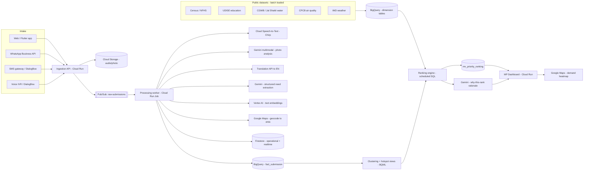
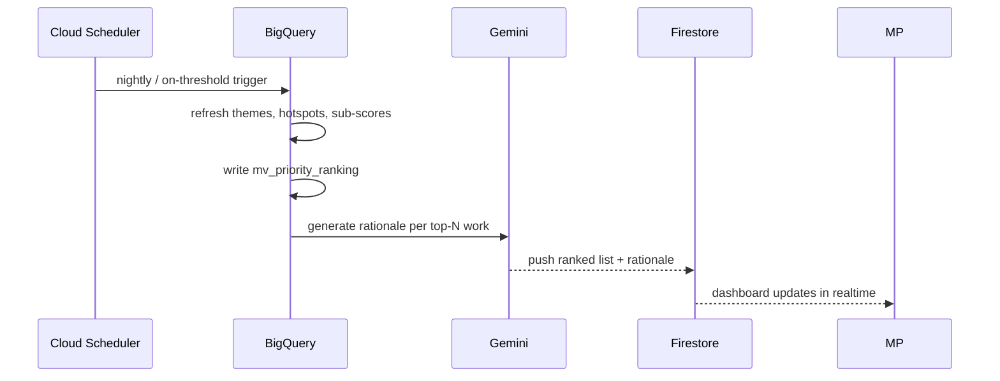

# JanVaani — Technical Architecture

> Focus of this document: **how processed citizen data is analysed and ranked**
> into a defensible, explainable priority list an MP can act on.
> Built on the organiser's recommended Google Cloud stack.

---

## 1. Design principles

1. **Demand alone never wins.** A priority is *validated demand* — citizen voice
   cross-checked against public data (population, service gaps, deprivation).
   This is the objective answer to "who shouted loudest."
2. **Everything explainable.** Every rank exposes its sub-scores and the evidence
   behind them. No black-box number reaches the MP.
3. **Batch, don't burn.** AI and ranking run in **scheduled/threshold batches**,
   not per-request → predictable, low cost (fits hackathon credits).
4. **Scale to zero.** Cloud Run + Cloud Functions + Firestore + BigQuery on-demand
   → ₹0 when idle.
5. **Reach everyone.** Voice, SMS, WhatsApp and web — no smartphone or literacy
   assumed.

---

## 2. System overview



---

## 3. Component mapping (organiser-recommended stack)

| Concern | Service | Notes |
|---|---|---|
| App shell + APIs | **Cloud Run** (Next.js 16) | scales to zero |
| Async processing | **Cloud Functions / Cloud Run Jobs** + **Pub/Sub** | decouples intake from AI; enables batching |
| Voice → text | **Cloud Speech-to-Text (Chirp)** | multilingual, incl. Indic |
| Conversational SMS/IVR | **Dialogflow CX** | low-connectivity intake |
| Photo understanding | **Gemini multimodal** (Vertex AI) | infra/issue detection from images |
| Translation | **Cloud Translation API** | normalise to English canonical |
| Reasoning / extraction / rationale | **Gemini 2.x (Flash / Flash-Lite)** via **Vertex AI** | cheap tier + credits |
| Embeddings | **Vertex AI `text-embedding`** | for clustering + dedup |
| Operational store + realtime | **Firebase / Firestore** | dashboard live updates, auth |
| Analytics + ranking | **BigQuery** (+ **BigQuery ML**) | joins citizen data with public datasets |
| Maps / geocoding / distance | **Google Maps Platform** | hotspots, travel-distance gaps |
| Satellite (advanced gaps) | **Earth Engine** | optional: built-up area, crop/flood |
| Media store | **Cloud Storage** | private, signed URLs |
| Scheduling | **Cloud Scheduler** | nightly / threshold recompute |
| TTS (accessibility, callbacks) | **Cloud Text-to-Speech** | read confirmations back to citizen |

---

## 4. Data model (BigQuery star schema)

**Fact**

`fact_submission`
| field | type | notes |
|---|---|---|
| submission_id | STRING | |
| created_at | TIMESTAMP | partition key |
| citizen_key | STRING | salted hash of phone → dedup / anti-spam |
| channel | STRING | web / whatsapp / sms / ivr |
| locale | STRING | source language |
| category / subcategory | STRING | from Gemini |
| need_en | STRING | normalised English need |
| urgency | FLOAT64 | 0–1 (Gemini) |
| embedding | ARRAY&lt;FLOAT64&gt; | for clustering + dedup |
| lat / lng / geohash | FLOAT64 / STRING | |
| ward_id / village_id / constituency_id | STRING | geocoded admin unit |
| theme_id | STRING | assigned by clustering |
| photo_labels | ARRAY&lt;STRING&gt; | from Gemini vision |
| is_anonymous | BOOL | |

**Dimensions** (keyed by `area_id`, one row per ward/village)

- `dim_area` — population, pop_0_14, pop_60plus, households, sc_pct, st_pct, literacy_pct, bpl_pct *(Census/NFHS)*
- `dim_education` — schools, enrolment, dropout_rate, pupil_teacher_ratio, nearest_secondary_km *(UDISE + Maps)*
- `dim_health` — phc_count, nearest_phc_km, immunization_pct, imr *(NFHS/facility)*
- `dim_water` — tap_coverage_pct, groundwater_stress *(CGWB/Jal Shakti)*
- `dim_air` — pm25, aqi_exceedance_days *(CPCB)*
- `dim_weather` — rainfall_anomaly, flood_risk *(IMD)*
- `dim_candidate_work` — work_id, title, category, target_area_id, est_cost, est_beneficiaries, **source** = `citizen` | `plan` *(MP's development plan uploads)*

The `source` field is the trick that lets a **plan-proposed** vocational centre be
scored on the **same scale** as a **citizen-demanded** school upgrade.

---

## 5. Processing pipeline (raw → structured)

Per submission, the worker produces one normalised `fact_submission` row:

1. **Transcribe** audio → text (Speech-to-Text Chirp) in the source language.
2. **See** the photo (Gemini multimodal) → labels + a one-line issue description.
3. **Translate** to English canonical (Translation API); keep the original.
4. **Extract** structured fields with Gemini (forced JSON schema):
   `{category, subcategory, need_en, urgency, entities[]}`.
5. **Embed** `need_en` (Vertex embeddings) for clustering + near-duplicate merge.
6. **Geocode** the stated location / GPS → `area_id` at ward + village + constituency.

Cost control: submissions fan through **Pub/Sub** and are processed in **micro-batches**;
embeddings and Gemini calls are cached by content hash so re-sends cost nothing.

---

## 6. Analysis

### 6.1 Theme clustering & de-duplication
Group submissions into **demand themes** so 400 reports of one road count as one
theme with weight 400 — not 400 problems.

- Candidate grouping key: `category × area × embedding-similarity`.
- Within a key, merge submissions whose embedding cosine ≥ 0.82 into a `theme_id`
  (BigQuery `ML.DISTANCE` / `VECTOR_SEARCH`, or BQML k-means for discovery).
- Each theme stores **unique-citizen count** (dedup on `citizen_key`), not raw count.

### 6.2 Hotspot mapping
- Aggregate theme demand to **H3 hex bins / admin units**.
- Demand density surfaces as a Google Maps heatmap.
- Optional statistical rigour: **Getis-Ord Gi\*** to flag *statistically significant*
  hotspots vs. random noise (guards against a single vocal cluster).

---

## 7. The Ranking Engine (core)

Every **candidate work** `W` (citizen-emergent *or* plan-proposed) gets a
**Priority Score 0–100** = weighted sum of six normalised, explainable components.

```
PriorityScore(W) = 100 × ( wD·D + wG·G + wP·P + wE·E + wC·C + wF·F )
                   where Σ w = 1
```

| Sym | Component | What it measures | Primary sources |
|---|---|---|---|
| **D** | **Demand intensity** | how strongly citizens want it | citizen submissions |
| **G** | **Service gap / deficit** | is the need objectively real? | UDISE, NFHS, CGWB, Maps |
| **P** | **Population impact** | how many people benefit | Census |
| **E** | **Equity / vulnerability** | is the area underserved / marginalised? | Census, NFHS |
| **C** | **Corroboration** | do data & citizens agree? (confidence) | cross-source |
| **F** | **Feasibility** | benefit per rupee, plan-eligibility | cost + MPLADS rules |

**Default weights** (MP-adjustable via dashboard sliders):
`wD=0.30, wG=0.25, wP=0.20, wE=0.15, wC=0.05, wF=0.05`.

### 7.1 Demand intensity `D` (with anti-gaming)
```
D_raw(W) = Σ over UNIQUE citizens i in theme(W)  [ recency_i × urgency_i ]
  recency_i = exp( −age_days_i / 90 )          # recent demand weighted higher
  urgency_i ∈ [0.5, 1.5]                        # from Gemini sentiment
  per-citizen weight capped at 1.5              # one person can't spam a rank
```
Small-sample areas are **Bayesian-shrunk** toward the constituency mean so a
village with 5 voices isn't ranked on noise.

### 7.2 Service gap `G` (category-specific — the objectivity layer)
Example (Education):
```
G_edu = 0.4·(1 − enrolment_ratio)
      + 0.3·min(nearest_secondary_km / 8 , 1)     # travel-distance gap (Maps)
      + 0.2·dropout_rate
      + 0.1·norm(pupil_teacher_ratio)
```
Analogous `G_water = (1 − tap_coverage) boosted by groundwater_stress`,
`G_health = f(nearest_phc_km, immunization…)`, `G_roads = f(connectivity, flood_risk)`.
**This is what makes "school upgrade vs vocational centre" objective** — each is
scored against the *measured deficit* in its own domain.

### 7.3 Population impact `P`
`P = norm(beneficiary_population)` — child population (0–14) for schools, total for
water/health, working-age for livelihood.

### 7.4 Equity `E` (corrects submission bias)
```
E = norm( 0.4·sc_st_pct + 0.3·bpl_pct + 0.3·(1 − literacy_pct) )
```
Counteracts the fact that affluent, digitally-literate wards submit more — so
under-served areas aren't drowned out.

### 7.5 Corroboration `C` & confidence
`C` = agreement between the top citizen-demanded category and the top
data-derived deficit in that area (0 / 0.5 / 1). Also drives a **confidence badge**
(sample size × corroboration) shown next to every rank.

### 7.6 Normalisation
Each component is **min-max / percentile normalised within the constituency**, so
scores are relative to the MP's own area, then combined. Runs as a scheduled
**BigQuery** query (or BQML) writing `mv_priority_ranking`.

### 7.7 Explainability
For each ranked work, Gemini turns the structured factors into a grounded, one-paragraph
rationale — e.g.:

> **#1 · Upgrade Govt. School, Ward 7 — score 87.**
> 412 unique citizens (last 90 days); nearest secondary school **6.2 km** away
> (UDISE); enrolment ratio 0.58; **38% SC/ST**, literacy 61%. Groundwater and health
> data show no competing deficit. Confidence: high.

The LLM only *narrates* numbers it is given — it never invents the rank.

---

## 8. Head-to-head comparison

Because plan-proposed and citizen-emergent works share the `dim_candidate_work`
table and the same scoring, the dashboard can put any two works side by side with
their component bars — directly serving the problem statement's
"school upgrade vs vocational centre" scenario.

---

## 9. Cost & security

**Cost** — Pub/Sub batching, content-hash caching of AI calls, Gemini **Flash-Lite**
for high-volume extraction, BigQuery **partitioned + clustered** tables, ranking
recomputed on a **schedule/threshold** (not per submission), everything scale-to-zero.

**Security** — Firebase Auth ID tokens; Firestore/Storage security rules; signed
upload URLs; `citizen_key` is a **salted hash** (no raw phone in analytics); PII kept
out of BigQuery; least-privilege service accounts via Application Default Credentials
(no key files in containers); anonymous submissions still counted but never attributed.

---

## 10. Recompute flow



---

## 11. v3 — what is actually implemented and deployed

The sections above are the full target design. To ship a **genuinely
end-to-end, deployable** slice within the hackathon window, the build makes two
pragmatic substitutions that preserve the same behaviour and explainability:

**Ranking runs in-process, not in BigQuery.** The 6-factor engine (§7) is
implemented in `src/lib/ranking.ts` and runs inside a Cloud Run route
(`POST /api/recompute`) over Firestore submissions joined with a seeded
public-data snapshot (`src/lib/publicData.ts`, standing in for the BigQuery
dimension tables of §4). It produces the *identical* factor breakdown, default
weights, normalisation, corroboration and confidence the dashboard renders — so
the MP experience is unchanged. Swapping to scheduled BigQuery SQL later is a
drop-in: the route becomes a Scheduler → BigQuery → `rankings/latest` write.

**The pipeline is per-request, not Pub/Sub-batched.** `POST /api/submissions`
runs the §5 pipeline inline: Cloud Storage upload → Speech-to-Text → Gemini
photo description → Gemini structured extraction → geocode → Firestore write.
Pub/Sub + Cloud Run Jobs remain the scale path; inline keeps the demo simple
and the cost trivial at hackathon volume.

**Live data flow, as built:**

```
Citizen (web) ─▶ POST /api/submissions
                   ├─ Cloud Storage (voice/photo, private)
                   ├─ Speech-to-Text (Chirp)         [guarded]
                   ├─ Gemini extraction + vision       [guarded]
                   └─ Firestore: submissions/{id}
POST /api/recompute (manual or Cloud Scheduler)
                   ├─ read submissions
                   ├─ cluster → 6-factor score (ranking.ts)
                   ├─ Gemini "why this rank" for top-N  [guarded]
                   └─ Firestore: rankings/latest
MP dashboard ─▶ GET /api/rankings ─▶ live snapshot (falls back to sample data)
```

**Graceful degradation.** Every Google Cloud call is guarded: with no
`GOOGLE_CLOUD_PROJECT` / credentials the app runs in **demo mode** — submissions
are accepted (keeping the citizen's own words), and the dashboard shows the
built-in sample snapshot. Nothing throws. This is what lets the same build run
locally with zero config and fully live on Cloud Run.

**Security.** Firestore and Storage are **deny-all to clients**
(`firestore.rules`, `storage.rules`); every read/write goes through the server
(Admin SDK). The `citizen_key` is a salted SHA-256 hash — no raw phone/PII in
the store. Credentials come from the attached service account via ADC — no key
files in the container.

**CI/CD.** GitHub Actions: `ci.yml` (lint · type-check · build) on every PR;
`deploy.yml` builds from source and deploys to Cloud Run on merge to `main` via
Workload Identity Federation. See [DEPLOY.md](DEPLOY.md).

---

## 12. Momentum — demand over time (v3.1)

The dashboard was a photograph; momentum makes it a movie. Every submission
already carries `createdAt`, so no new capture is needed — the ranking engine
buckets each theme's timestamps into a **12-week volume sparkline** and a
**recent-30d-vs-prior-30d** change (`src/lib/ranking.ts` → `computeTrend`).

- **Signal.** `trend = { direction: rising|falling|flat, changePct, spark[] }`
  attached to every `Work`. `rising` iff recent > prior and `changePct ≥ 20%`;
  `falling` iff the mirror. This distinguishes a **political emergency** (a need
  accelerating) from a **budget line** (a flat chronic one) — the single most
  decision-relevant fact, computed for free from data we already store.
- **Surface.** Each ranked work card shows the sparkline + a signed-% badge
  (`src/components/Momentum.tsx`); the sample snapshot (`dashboardData.ts`)
  carries hand-tuned trends so the demo reads well with or without live volume.
- **Scale path.** In the BigQuery target this is a windowed `COUNT(*) OVER` on
  the `fact_submission` table — the in-process version computes the identical shape.

## 13. Accountability loop — status + public board (v3.1)

Demand without response is a one-way mirror. Works now carry a **response
status** the MP sets and citizens can see.

- **Model.** `workStatus/{workId}` in Firestore, keyed by the *stable* work id
  so status survives every ranking recompute. Values:
  `new → acknowledged → sanctioned → in_progress → completed`.
- **APIs.** `GET /api/status` joins `rankings/latest` with `workStatus` into a
  full board; `POST /api/status { workId, status, note? }` sets one (MP action,
  also the sink for the assistant's confirmed actions). Server-mediated like
  everything else; validated against the status enum.
- **MP side.** A status selector on each work card (`dashboard/page.tsx`),
  optimistic update + persist.
- **Citizen side.** A public, no-login board at **`/status`** ("You spoke. We
  acted.") showing each need's progression. This closes the loop the brief asked
  for without a per-citizen notification channel (most submissions are anonymous;
  FCM is future work). Notifications remain the P2 upgrade.

## 14. Media evidence (v3.1)

Voice submissions can now carry a **reference photo**, and the MP can play the
voice note and view the photo from the submission detail. Media stays in the
private bucket; `GET /api/media/{id}?kind=audio|photo` streams it server-side
(client Storage stays deny-all). The submissions API exposes `photoUrl`/`audioUrl`
pointers only when media exists.

## 15. Bulk ingestion (v3.1)

MP offices hold complaint registers outside the app. `GET /api/bulk?template=csv|xlsx`
serves the expected format; `POST /api/bulk` (multipart) parses a CSV/XLSX
(quote-aware CSV parser; `exceljs` for XLSX), normalises each row into the same
`submissions` shape (`channel: "bulk"`), area-resolves from name/GPS, writes in
≤400-doc Firestore batches, then triggers a recompute — so bulk rows rank, map
and drill down exactly like citizen voices. Capped at 1,000 rows/file.

## 16. Gemini dashboard assistant (v3.1)

A chat embedded in the MP dashboard (`src/components/AssistantChat.tsx` →
`POST /api/assistant`). Every answer is **grounded server-side** in the live
ranked works + momentum + status (never free-floating): the route builds a
compact JSON context and calls Gemini (`askAssistant` in `ai.ts`, forced-JSON).

- **Answer-and-confirm, never a silent write.** When the MP asks to change a
  status the model returns a structured `action`; the UI renders a **Confirm**
  button and only then calls `POST /api/status`. An AI misread can't mutate data
  on its own — the security posture the design requires.
- **Always answers.** If Vertex AI is off or errors, a deterministic rule-based
  fallback (`ruleFallback`) handles momentum / area / status / priority intents,
  so the assistant works in demo mode too.

**Recompute is now auto-triggered.** Both `POST /api/submissions` and
`POST /api/bulk` call the shared `recomputeAndStore` (`src/lib/recompute.ts`,
rationale-free fast path) after writing, so KPIs, momentum, hotspots and the
ranked list update immediately — the periodic full recompute (`/api/recompute`,
with Gemini rationale) still runs for the richer "why this rank" prose.

## 17. MP provisioning & constituency scoping (v3.2)

MPs are **provisioned, never password-shared**. An `mpAccounts/{token}`
Firestore record binds one MP (by email) to exactly one constituency:
`{ email, name, constituency, status: invited|active, inviteToken }`.

**Flow**
```
Admin (/admin/mps, admin-key gated)
  └─ POST /api/mp  → creates mpAccounts record + one-time invite link
MP opens /mp-activate?token=…
  └─ GET  /api/mp/resolve?token=  → previews the allocation (constituency)
  └─ POST /api/mp/resolve {token}  → marks active; session bound to constituency
Returning MP → Google sign-in
  └─ GET  /api/mp/resolve?email=  → resolves their constituency (can't self-pick)
Dashboard → GET /api/submissions?constituency=<bound>  → scoped citizen voices
```

- **The MP never chooses their constituency** — it comes from the admin's
  allocation, resolved server-side by email/token.
- **Scoping today:** the citizen-voice feed (map, drill-down, "voices") filters
  by the bound constituency; rows saved before constituency capture count as the
  seeded default so the pilot MP still sees existing data.
- **Admin gate:** a single server-side `MP_ADMIN_KEY` env (pilot-grade). Set it
  on Cloud Run; the code default is for local/demo only.

> **Two honest limits, both flagged in-product:**
> 1. **Enforcement.** Auth is still the localStorage session, so scoping is
>    *functional*, not yet *tamper-proof*. Production wires real Firebase Auth:
>    the constituency becomes a **custom claim** on the verified ID token, and
>    the API + Firestore rules enforce `where constituency == token.claim`. The
>    `mpAccounts` table built here is exactly the allocation source that step reads.
> 2. **Per-constituency ranking.** The 6-factor objective layer (§4, §7) is
>    seeded for one constituency (Nawada). A newly-provisioned constituency shows
>    its citizen voices; a full ranking needs that constituency's public datasets
>    (Census/UDISE/CGWB/…) loaded as its own snapshot.

## 18. Feasibility & cost estimate agent (v3.3)

An MP-triggered agent that turns a citizen voice into a rough, structured
feasibility + cost estimate for **early prioritisation — not a quotation**.

**Flow:** MP opens a voice → clicks *Estimate feasibility & cost* →
`POST /api/estimate` → `estimateFeasibility()` (`gemini-2.5-flash`) returns
structured JSON: `{ scope, eligibility{mplads,note}, boq[], costLow, costHigh,
timelineWeeks, risks[], assumptions[], confidence, source }`. Rendered in the
submission detail with a cost band, bill of quantities, MPLADS-eligibility badge,
risks, and a prominent *"AI estimate — verify before sanctioning"* disclaimer.

- **Honest by construction.** The prompt is grounded in typical Indian
  Schedule-of-Rates ranges (per category, `src/lib/estimate.ts` → `categoryBand`),
  outputs assumptions + a confidence band, and validates/clamps the numbers.
  When Vertex AI is off or the call fails, a deterministic **category-band
  fallback** produces a labelled `source: "fallback"` estimate so the button
  always works.
- **Cached** per submission in `estimates/{id}` (Firestore) so re-opening a voice
  doesn't re-bill Gemini; `refresh:true` recomputes.
- **Roadmap:** V2 grounds the bill of quantities against a real **state PWD
  Schedule of Rates**; V3 lets the MP *accept* an estimate to set that work's
  **Feasibility (F)** factor — replacing today's per-category constant with
  evidence, and enabling a cost-effectiveness (impact-per-rupee) term.

## 19. Official constituencies, bulk MP provisioning & access control (v3.4)

**Single official constituency list.** `src/lib/constituencies.ts` holds **all
543** ECI Lok Sabha parliamentary constituencies across every state/UT (with
Telangana split from Andhra Pradesh and Ladakh from J&K so state grouping is
current), grouped by state in the dropdowns. Both the citizen Raise-your-
voice page and the admin MP-assignment use the SAME dropdown, so a voice's
constituency is guaranteed to match an MP's assigned constituency (no more
free-text mismatch — the earlier root cause of mis-routed voices). The API
validates/normalises every constituency against this list (`resolveConstituency`).

**Bulk MP provisioning.** `GET /api/mp/bulk?template=csv|xlsx` serves a template
(columns: email · name · constituency); `POST /api/mp/bulk` (admin-gated,
multipart) validates each row's constituency against the official list, creates/
updates one allocation per row (re-uploading an email reuses its token), and
returns each row's invite link or a per-row error. Mirrors the complaint bulk
upload.

**Access control.** MP allocations carry `status: invited | active | revoked`.
The admin console can **deactivate** (→ `revoked`) or **reactivate** any account
(`PATCH /api/mp`). A revoked account is rejected by `/api/mp/resolve` (403) at
both activation and returning sign-in, so it immediately loses the ability to
bind a constituency and reach a dashboard.
